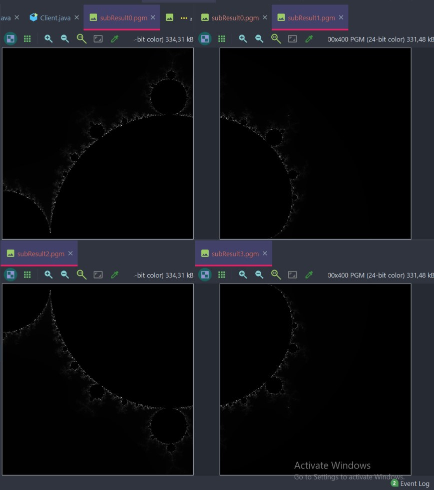

# mandelbrot
This is a code test that calculate and render the mandelbrot set. The workload can be divided between several servers, speeding up the calculation time and achieving parallelism if you so will. 

To run the program:

Clone the repository

Start the main method in the server classes, check port number in constructor

Adjust the input parameters in the string just ahead of the Client contructor, and run. 

Wait for results to show up in Results folder. 

----------------
This has been challenging and very fun to do. Way over my head I felt at the beginning. But now it works, or at least it is well on its way to do so. It definitely needs more testing around with the input parameters.  

Room for improvments: 

I certainly need to re-work the structure of the program in a more OOP way for reusability 

Methods should have return values and arguments! That is not the case in this project yet

Get some tests going for the methods

Read user input from system args - go look at the branch system-args-input

I think the grey scale might shall be inverted

Use HTTP protocol like a normal person

A way more extensive exeption handling

Put the calculation time in the result files name

Be able to combine all sub-results to one combine image

